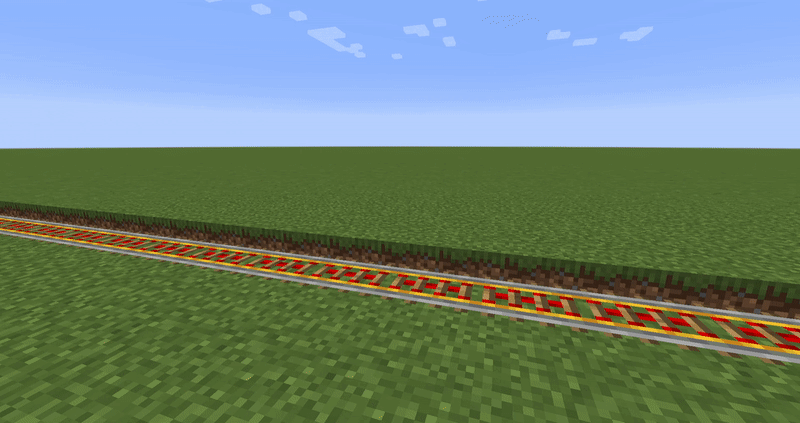

**This mod is in an alpha state, and I will be really surprised if nothing breaks while using it, so for the love of the almighty Notch, make backup of your world before using this mod**

**More Mounted Storages** mod allows for a greater variety of the modded storages to be used as a part of Create moving contraptions, as well as providing an API for other mod makers to add their own types of mounted storages.

## Currently supported mods:
- [Ender Storage](https://www.curseforge.com/minecraft/mc-mods/ender-storage-1-8)
- [Iron Chests](https://www.curseforge.com/minecraft/mc-mods/iron-chests)
- [Storage Drawers](https://www.curseforge.com/minecraft/mc-mods/storage-drawers)
- [Framed Compacting Drawers](https://www.curseforge.com/minecraft/mc-mods/framed-compacting-drawers)
- [Immersive Engineering](https://www.curseforge.com/minecraft/mc-mods/immersive-engineering)
- [Industrial Foregoing](https://www.curseforge.com/minecraft/mc-mods/industrial-foregoing)
- [PneumaticCraft: Repressurized](https://www.curseforge.com/minecraft/mc-mods/pneumaticcraft-repressurized''')